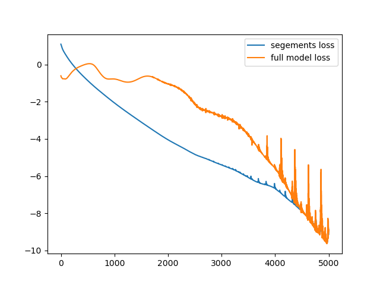
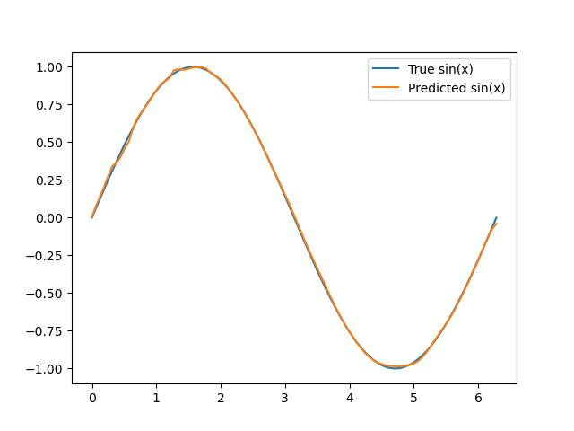

# Multi-Segment Neural Network for $ \sin(x) $ Approximation

## Project Description
This project implements a segmented neural network to approximate the function $ y = \sin(x) $. The network is divided into three segments, each trained independently with trainable intermediate states. The final model is capable of directly mapping input $ x $ to output $ y $.

## Architecture

### Input and Output
- **Input**: $ x \in \mathbb{R}^{100 \times 1} $ (discretized points in the range $[0, 2\pi]$).
- **Output**: $ y \in \mathbb{R}^{100 \times 1} $, representing $ \sin(x) $.

### Network Structure
- The network is divided into **3 segments**:
  1. **Segment 1**: Maps $ x $ to $ M_0 $ (trainable middle state).
  2. **Segment 2**: Maps $ M_0 $ to $ M_1 $ (trainable middle state).
  3. **Segment 3**: Maps $ M_1 $ to $ y $.

- Each segment consists of:
  - **2 hidden layers**:
    - **Units**: 16
    - **Activation**: ReLU
  - **1 output layer**:
    - **Activation**: Linear

- **Middle States**: $ M_0 \in \mathbb{R}^{100 \times 16} $ and $ M_1 \in \mathbb{R}^{100 \times 16}$ are **randomly initialized** and are **trainable** during training.

## Training Details

### Loss Function
The total loss is the sum of the errors in each segment:
$$
\mathcal{L}_{total} = \mathcal{L}_1 + \mathcal{L}_2 + \mathcal{L}_3
$$
Where:
 $ \mathcal{L}_1 = \frac{1}{n} \sum_{i=1}^{n} (M_{0,i} - \hat{M}_{0,i})^2 $
 $ \mathcal{L}_2 = \frac{1}{n} \sum_{i=1}^{n} (M_{1,i} - \hat{M}_{1,i})^2 $
 $ \mathcal{L}_3 = \frac{1}{n} \sum_{i=1}^{n} (y_i - \hat{y}_i)^2 $

Where:
- $ M_0 $ and $ M_1 $ are the trainable middle states.
- $ \hat{M}_0 $ and $ \hat{M}_1 $ are the outputs of the segments.
- $ y $ is the target output (sine function).

### Optimizer
- **Algorithm**: Adam Optimizer
- **Learning Rate**: $ 0.001 $

### Training Process
1. **Segment 1**: Trains to minimize the error between its output and $ M_0 $.
2. **Segment 2**: Trains to minimize the error between its output and $ M_1 $.
3. **Segment 3**: Trains to minimize the error between its output and $ y $.

Each middle state ($ M_0 $, $ M_1 $) is updated during the corresponding segment's training.

### Epochs
- Total: 1000 epochs.

### Results
- 

- 